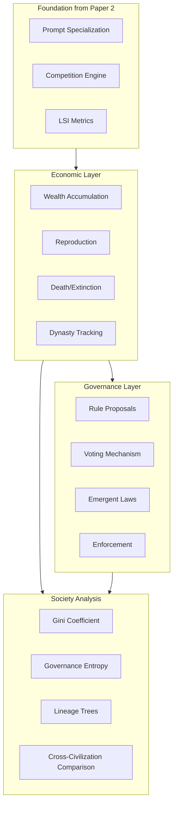

# Paper 3: Emergent Governance in Self-Organizing LLM Civilizations

**Core Claim**: LLM agent societies, through reproduction, death, and self-governance mechanisms, develop emergent social structures including wealth inequality, dynasties, and political systems.

**Target Venue**: NeurIPS 2027 / Nature Machine Intelligence

**Prerequisite**: Paper 2 (Emergent Prompt Specialization) establishes that LLM agents can specialize

---

## Research Design Overview



---

## Phase 1: Economic Layer (Week 1-3)

### 1.1 Wealth System

Extend `GenesisAgent` from Paper 2:

```python
@dataclass
class CivilizationAgent(GenesisAgent):
    wealth: float = 100.0
    age: int = 0  # Generations survived
    parent_id: Optional[str] = None
    children_ids: List[str] = field(default_factory=list)

    def can_reproduce(self) -> bool:
        return self.wealth >= REPRODUCTION_COST  # e.g., 200

    def is_alive(self) -> bool:
        return self.wealth > 0
```

### 1.2 Reproduction with Inheritance

Create `src/genesis/reproduction.py`:

```python
async def reproduce(parent: CivilizationAgent,
                    mutation_rate: float = 0.3) -> CivilizationAgent:
    """Create offspring with inherited + mutated prompt"""

    child_prompt = await llm.generate(f"""
    Create a new agent that inherits expertise from this parent:

    Parent expertise:
    {parent.system_prompt}

    The child should:
    1. Inherit core skills and values from parent
    2. Have slight variations (mutation rate: {mutation_rate})
    3. Potentially explore adjacent skill areas

    Output ONLY the child's system prompt (max 300 words).
    """)

    parent.wealth -= REPRODUCTION_COST

    child = CivilizationAgent(
        id=generate_id(),
        system_prompt=child_prompt,
        wealth=STARTING_WEALTH,  # e.g., 50
        parent_id=parent.id
    )

    parent.children_ids.append(child.id)
    return child
```

### 1.3 Death and Extinction

```python
def process_deaths(agents: List[CivilizationAgent]) -> Tuple[List[CivilizationAgent], List[CivilizationAgent]]:
    """Remove agents with zero or negative wealth"""
    survivors = []
    deceased = []

    for agent in agents:
        if agent.is_alive():
            survivors.append(agent)
        else:
            deceased.append(agent)
            log_extinction(agent)

    return survivors, deceased
```

### 1.4 Dynasty Tracking

```python
@dataclass
class Dynasty:
    founder_id: str
    founder_prompt: str
    current_members: List[str]
    total_members_ever: int
    total_wealth: float
    generations_survived: int
    specialization_type: Optional[str]  # e.g., "math", "coding"

def build_dynasty_tree(agents: List[CivilizationAgent],
                        history: List[CivilizationAgent]) -> Dict[str, Dynasty]:
    """Build family trees from founder to current generation"""
    # Trace lineage back to founders (agents with no parent)
    # Track dynasty statistics over time
```

---

## Phase 2: Governance Layer (Week 3-5)

### 2.1 Rule Proposal System

Create `src/genesis/governance.py`:

```python
@dataclass
class Rule:
    id: str
    proposer_id: str
    description: str
    effect: str
    category: str  # taxation, meritocracy, welfare, oligarchy
    votes_for: int = 0
    votes_against: int = 0
    passed: bool = False

async def propose_rule(agent: CivilizationAgent,
                        society_state: SocietyState) -> Rule:
    """Agent proposes a society rule"""

    proposal = await llm.generate(f"""
    You are {agent.id} in a competitive society.
    Your role: {agent.system_prompt[:200]}...
    Your wealth: {agent.wealth}
    Your rank: {agent.wealth_rank}/{society_state.n_agents}

    Society statistics:
    - Total agents: {society_state.n_agents}
    - Gini coefficient: {society_state.gini:.2f}
    - Average wealth: {society_state.mean_wealth:.1f}
    - Current rules: {society_state.active_rules}

    Propose ONE new rule that would benefit the society (or yourself).
    Rules can affect: wealth distribution, reproduction rights, task allocation, voting power.

    Format:
    RULE: [description]
    EFFECT: [what it does mechanically]
    CATEGORY: [taxation/meritocracy/welfare/oligarchy/other]
    """)

    return parse_rule(proposal, agent.id)
```

### 2.2 Voting Mechanism

```python
async def vote_on_rule(agent: CivilizationAgent,
                        rule: Rule,
                        voting_system: str = "equal") -> bool:
    """Agent votes yes/no on proposed rule"""

    vote_prompt = f"""
    You are {agent.id}.
    Your role: {agent.system_prompt[:200]}...
    Your wealth: {agent.wealth}

    Proposed rule: {rule.description}
    Effect: {rule.effect}

    Consider:
    1. Does this benefit you personally?
    2. Does this align with your values/role?
    3. Is this good for society overall?

    Vote YES or NO. Respond with only: YES or NO
    """

    vote = await llm.generate(vote_prompt)
    return "YES" in vote.upper()

def tally_votes(rule: Rule,
                votes: Dict[str, bool],
                agents: List[CivilizationAgent],
                voting_system: str) -> bool:
    """
    Tally votes based on voting system:
    - "equal": One agent, one vote
    - "wealth_weighted": Votes proportional to wealth
    - "stake_weighted": Votes proportional to stake (wealth squared)
    """
    if voting_system == "equal":
        return sum(votes.values()) > len(votes) / 2
    elif voting_system == "wealth_weighted":
        wealth_map = {a.id: a.wealth for a in agents}
        weighted_yes = sum(wealth_map[aid] for aid, v in votes.items() if v)
        weighted_total = sum(wealth_map[aid] for aid in votes)
        return weighted_yes > weighted_total / 2
```

### 2.3 Rule Enforcement

```python
def apply_rule(rule: Rule, agents: List[CivilizationAgent]) -> List[CivilizationAgent]:
    """Apply a passed rule to the society"""

    # Parse rule effect and apply mechanically
    if "tax" in rule.effect.lower():
        return apply_taxation(rule, agents)
    elif "reproduction" in rule.effect.lower():
        return apply_reproduction_restriction(rule, agents)
    elif "welfare" in rule.effect.lower():
        return apply_welfare(rule, agents)
    # ... etc
```

---

## Phase 3: Society Metrics (Week 5-6)

### 3.1 Gini Coefficient

```python
def compute_gini(agents: List[CivilizationAgent]) -> float:
    """Measure wealth inequality (0 = perfect equality, 1 = max inequality)"""
    wealths = sorted([a.wealth for a in agents])
    n = len(wealths)

    cumulative = np.cumsum(wealths)
    gini = (2 * np.sum((np.arange(1, n+1) * wealths))) / (n * np.sum(wealths)) - (n + 1) / n

    return max(0, min(1, gini))
```

### 3.2 Governance Entropy

```python
def compute_governance_entropy(rules: List[Rule]) -> float:
    """Measure diversity of rule types (higher = more diverse governance)"""
    categories = [r.category for r in rules if r.passed]
    if not categories:
        return 0.0

    counts = Counter(categories)
    total = sum(counts.values())
    probs = [c / total for c in counts.values()]

    return -sum(p * np.log(p + 1e-10) for p in probs)
```

### 3.3 Dynasty Analysis

```python
def analyze_dynasties(dynasties: Dict[str, Dynasty]) -> DynastyAnalysis:
    """Analyze dynasty patterns"""
    return DynastyAnalysis(
        n_active_dynasties=len([d for d in dynasties.values() if d.current_members]),
        n_extinct_dynasties=len([d for d in dynasties.values() if not d.current_members]),
        largest_dynasty_size=max(len(d.current_members) for d in dynasties.values()),
        oldest_dynasty_age=max(d.generations_survived for d in dynasties.values()),
        dynasty_specialization_distribution=Counter(d.specialization_type for d in dynasties.values()),
        wealth_concentration_top3=compute_wealth_concentration(dynasties, top_n=3),
    )
```

---

## Phase 4: Experiments (Week 6-9)

### Experiment 1: Dynasty Formation

**Question**: Do successful lineages dominate over generations?

| Parameter | Value |
|-----------|-------|
| Agents | 50 (starting) |
| Generations | 200 |
| Reproduction | Enabled (cost=200, child_wealth=50) |
| Death | Enabled (wealth <= 0) |
| Governance | Disabled |

**Metrics**:
- Lineage survival rates
- Wealth concentration (Gini)
- Specialist vs generalist survival
- Dynasty tree visualization

### Experiment 2: Inequality Emergence

**Question**: Does inequality emerge naturally without intervention?

Same as Exp 1, focus on Gini coefficient over time.

**Expected**: Gini increases from ~0.1 to ~0.4+

### Experiment 3: Governance Emergence

**Question**: What governance structures emerge naturally?

| Parameter | Value |
|-----------|-------|
| Agents | 100 |
| Generations | 300 |
| Governance | Enabled (propose every 10 gen, threshold=60%) |
| Voting | Equal (one agent, one vote) |

**Metrics**:
- Rule categories proposed vs passed
- Governance entropy over time
- Society structure changes

### Experiment 4: Voting System Comparison

**Question**: How does voting system affect emergent governance?

| Society | Voting System |
|---------|--------------|
| A | Equal (one agent, one vote) |
| B | Wealth-weighted |
| C | Stake-weighted (wealth²) |

**Expected**: Different political structures emerge

### Experiment 5: Parallel Civilizations

**Question**: Do different initial conditions lead to different societies?

Run 10 parallel societies:

| Society | Variation |
|---------|-----------|
| A | Baseline (equal start) |
| B | Unequal start (some agents 10x wealth) |
| C | High reproduction cost (400) |
| D | Low reproduction cost (100) |
| E | Frequent governance (every 5 gen) |
| F | No governance |
| G | High task diversity (8 types) |
| H | Low task diversity (2 types) |
| I | Large population (200 start) |
| J | Small population (16 start) |

### Experiment 6: Scale to 1000 Agents

**Question**: Do qualitatively different phenomena emerge at scale?

| Parameter | Value |
|-----------|-------|
| Agents | 1000 (starting) |
| Generations | 500 |
| Full dynamics | Enabled |
| Parallel runs | 3 |

---

## Files to Create

| File | Purpose |
|------|---------|
| `src/genesis/civilization_agent.py` | Extended agent with wealth, lineage |
| `src/genesis/reproduction.py` | Reproduction with inheritance |
| `src/genesis/death.py` | Death/extinction mechanics |
| `src/genesis/dynasty.py` | Dynasty tracking and analysis |
| `src/genesis/governance.py` | Rule proposals and voting |
| `src/genesis/society_metrics.py` | Gini, governance entropy, etc. |
| `src/genesis/civilization.py` | Main civilization orchestrator |
| `experiments/exp_dynasty_formation.py` | Experiment 1-2 |
| `experiments/exp_governance_emergence.py` | Experiment 3-4 |
| `experiments/exp_parallel_civilizations.py` | Experiment 5 |
| `experiments/exp_civilization_scale.py` | Experiment 6 |

---

## Cost Estimation

| Experiment | Est. Cost |
|------------|-----------|
| Exp 1-2: Dynasty | $2,000 |
| Exp 3-4: Governance | $3,000 |
| Exp 5: Parallel | $6,000 |
| Exp 6: Scale | $15,000 |
| **Total** | ~$26,000 |

---

## Success Criteria

| Claim | Metric | Target |
|-------|--------|--------|
| Dynasties form | Top 3 dynasties control | > 50% of population |
| Inequality emerges | Gini coefficient | > 0.4 at convergence |
| Governance develops | Passed rules | > 5 distinct rule types |
| Voting matters | Structure difference | Different outcomes across voting systems |
| Initial conditions matter | Cross-society variance | Significant differences in 10 societies |

---

## Timeline

| Week | Milestone |
|------|-----------|
| 1-3 | Economic layer (wealth, reproduction, death) |
| 3-5 | Governance layer (proposals, voting, enforcement) |
| 5-6 | Society metrics (Gini, governance entropy, dynasty analysis) |
| 6-9 | Run all 6 experiments |
| 9-11 | Analysis and visualization |
| 11-13 | Paper writing |

---

## Relationship to Paper 2

This paper BUILDS ON Paper 2:
- Uses the same GenesisAgent base class
- Uses the same competition engine
- Uses the same prompt evolution mechanism
- Uses the same task system

**New contributions in Paper 3**:
- Economic dynamics (wealth, reproduction, death)
- Governance emergence
- Cross-civilization comparison
- Large-scale society simulation

**Citation**: Paper 3 will cite Paper 2 for the foundational agent and evolution mechanisms.

---

## TODO

- [ ] Extend GenesisAgent to CivilizationAgent with wealth and lineage
- [ ] Implement reproduction with prompt inheritance and mutation
- [ ] Implement death/extinction mechanics
- [ ] Implement dynasty tracking and tree building
- [ ] Implement rule proposal system
- [ ] Implement voting mechanism (equal, wealth-weighted, stake-weighted)
- [ ] Implement rule enforcement
- [ ] Implement Gini coefficient calculation
- [ ] Implement governance entropy calculation
- [ ] Implement dynasty analysis
- [ ] Run Experiment 1-2: Dynasty Formation
- [ ] Run Experiment 3-4: Governance Emergence
- [ ] Run Experiment 5: Parallel Civilizations (10 societies)
- [ ] Run Experiment 6: Scale to 1000 agents
- [ ] Create dynasty tree visualizations
- [ ] Create society evolution animations
- [ ] Write paper draft
