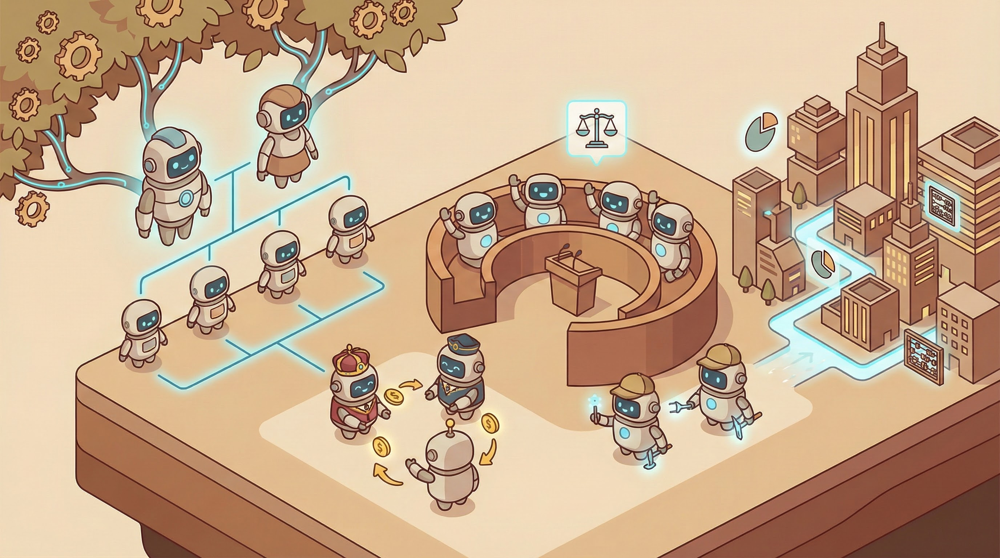

# Emergent Governance in Self-Organizing LLM Civilizations

<p align="center">
  
</p>

<p align="center">
  <a href="#overview">Overview</a> •
  <a href="#key-innovations">Key Innovations</a> •
  <a href="#quick-start">Quick Start</a> •
  <a href="#experiments">Experiments</a> •
  <a href="#citation">Citation</a>
</p>

<p align="center">
  
  
  
</p>

---

## Overview

**Can LLM agent societies develop complex social structures—wealth inequality, dynasties, and governance—through emergent dynamics alone?**

This project demonstrates that populations of LLM agents, when given economic incentives and governance mechanisms, spontaneously develop:

- **Dynasties**: Family lineages that persist across generations
- **Inequality**: Wealth concentration (Gini > 0.4)
- **Governance**: Agents propose and vote on their own rules

```
Generation 0              Generation 100              Generation 500
┌─────────────┐          ┌─────────────┐          ┌─────────────────┐
│ 100 identical│   ───→   │ Specialized │   ───→   │ Complex Society │
│   agents     │          │   dynasties │          │   with laws     │
└─────────────┘          └─────────────┘          └─────────────────┘
     Equal wealth           Wealth diverges          Emergent governance
```

---

## Key Innovations

### 1. Economic Dynamics

```python
@dataclass
class CivilizationAgent:
    system_prompt: str      # Evolvable role
    wealth: float = 100.0   # Economic resource
    parent_id: str = None   # Lineage tracking

    def can_reproduce(self) -> bool:
        return self.wealth >= REPRODUCTION_COST  # e.g., 200

    def is_alive(self) -> bool:
        return self.wealth > 0  # Death when bankrupt
```

### 2. Dynasty Formation

Successful agents spawn offspring with inherited (mutated) prompts:

```
Founder (Gen 0)
└── Child 1 (Gen 1)
    ├── Grandchild 1 (Gen 2)
    └── Grandchild 2 (Gen 2)
        └── Great-grandchild (Gen 3)
```

### 3. Emergent Governance

Agents propose and vote on rules—**we don't program specific rules**:

| Category | Example Emergent Rule |
|----------|----------------------|
| **Taxation** | "Agents with wealth > 500 pay 10% to common pool" |
| **Meritocracy** | "Only top performers can reproduce" |
| **Welfare** | "Minimum wealth guarantee of 20" |
| **Oligarchy** | "High-wealth agents get double votes" |

```python
async def propose_rule(agent, society_state):
    """Agent proposes a rule based on their position and values"""
    proposal = await llm.generate(f"""
    You are {agent.id} with wealth {agent.wealth}.
    Society Gini: {society_state.gini}

    Propose ONE rule that would benefit you or society.
    """)
    return parse_rule(proposal)
```

---

## Quick Start

### Installation

```bash
git clone https://github.com/HowardLiYH/Emergent-Civilizations.git
cd Emergent-Civilizations
pip install -r requirements.txt
export OPENAI_API_KEY="your-key"
```

### Run Dynasty Experiment

```python
from src.genesis import CivilizationSimulation

sim = CivilizationSimulation(
    n_agents=100,
    n_generations=300,
    reproduction_enabled=True,
    governance_enabled=True,
    voting_system="equal"
)

results = await sim.run()

print(f"Final Gini: {results.gini:.3f}")
print(f"Active dynasties: {results.n_active_dynasties}")
print(f"Passed rules: {results.n_passed_rules}")
```

---

## Experiments

### Experiment Suite

| # | Experiment | Question | Scale |
|---|------------|----------|-------|
| 1 | Dynasty Formation | Do lineages dominate? | 50 agents, 200 gen |
| 2 | Inequality Emergence | Does wealth concentrate? | 50 agents, 200 gen |
| 3 | Governance Emergence | What rules emerge? | 100 agents, 300 gen |
| 4 | Voting Comparison | How does voting affect outcomes? | 3 × 100 agents |
| 5 | **Parallel Civilizations** | Do initial conditions matter? | 10 × 100 agents |
| 6 | Scale Test | What emerges at 1000 agents? | 1000 agents, 500 gen |

### Parallel Civilizations Experiment

Run 10 societies with different initial conditions:

| Society | Variation | Expected Outcome |
|---------|-----------|------------------|
| A | Equal start | Baseline |
| B | Unequal start | Faster concentration |
| C | High reproduction cost | Fewer dynasties |
| D | Low reproduction cost | Population explosion |
| E | Frequent governance | More rules |
| F | No governance | Pure economy |
| G | 8 task types | More specialists |
| H | 2 task types | Less diversity |
| I | 200 agents | Larger society |
| J | 16 agents | Smaller society |

---

## Project Structure

```
emergent_civilizations/
├── src/genesis/
│   ├── civilization_agent.py  # Extended agent with wealth, lineage
│   ├── reproduction.py        # Offspring creation with inheritance
│   ├── death.py               # Death/extinction mechanics
│   ├── dynasty.py             # Dynasty tracking and analysis
│   ├── governance.py          # Rule proposals, voting, enforcement
│   ├── society_metrics.py     # Gini, governance entropy, mobility
│   └── civilization.py        # Main orchestrator
├── experiments/
│   ├── exp_dynasty_formation.py
│   ├── exp_governance_emergence.py
│   └── exp_parallel_civilizations.py
├── results/
└── paper/
```

---

## Metrics

### Society-Level Metrics

| Metric | Formula | Interpretation |
|--------|---------|----------------|
| **Gini** | Wealth inequality | 0 = equal, 1 = one has all |
| **Governance Entropy** | Rule diversity | High = diverse laws |
| **Dynasty Concentration** | Top 3 dynasties' share | Measures oligarchy |
| **Social Mobility** | Rank changes over time | Measures fluidity |

### Expected Results

| Metric | Target |
|--------|--------|
| Gini at convergence | > 0.4 |
| Top 3 dynasties control | > 50% of population |
| Distinct rule categories | > 5 |
| Cross-society variance | Significant |

---

## Theoretical Foundation

This work bridges multiple disciplines:

| Field | Connection |
|-------|------------|
| **Evolutionary Biology** | Selection, inheritance, extinction |
| **Economics** | Wealth dynamics, inequality emergence |
| **Political Science** | Governance emergence, voting systems |
| **Sociology** | Social stratification, class formation |
| **AI Safety** | Emergent behavior in agent populations |

### Key Insight

> Social structures emerge not from top-down design, but from the **interaction of simple rules**: compete, accumulate, reproduce, vote. The complexity is emergent.

---

## Related Projects

| Project | Relationship |
|---------|--------------|
| [Emergent-Specialization](https://github.com/HowardLiYH/Emergent-Specialization-in-Multi-Agent-Systems) | Paper 1: Rule-based agents (foundation) |
| [Emergent-Prompt-Evolution](https://github.com/HowardLiYH/Emergent-Prompt-Evolution) | Paper 2: LLM prompt evolution (prerequisite) |

---

## Citation

```bibtex
@article{emergent_civilizations_2027,
  title={Emergent Governance in Self-Organizing LLM Civilizations},
  author={Li, Yuhao and others},
  journal={Nature Machine Intelligence},
  year={2027}
}
```

---

## License

MIT License - See [LICENSE](LICENSE) for details.

---

<p align="center">
  <b>Part of the Emergent Specialization Research Series</b><br>
  <i>Paper 3 of 3</i>
</p>
